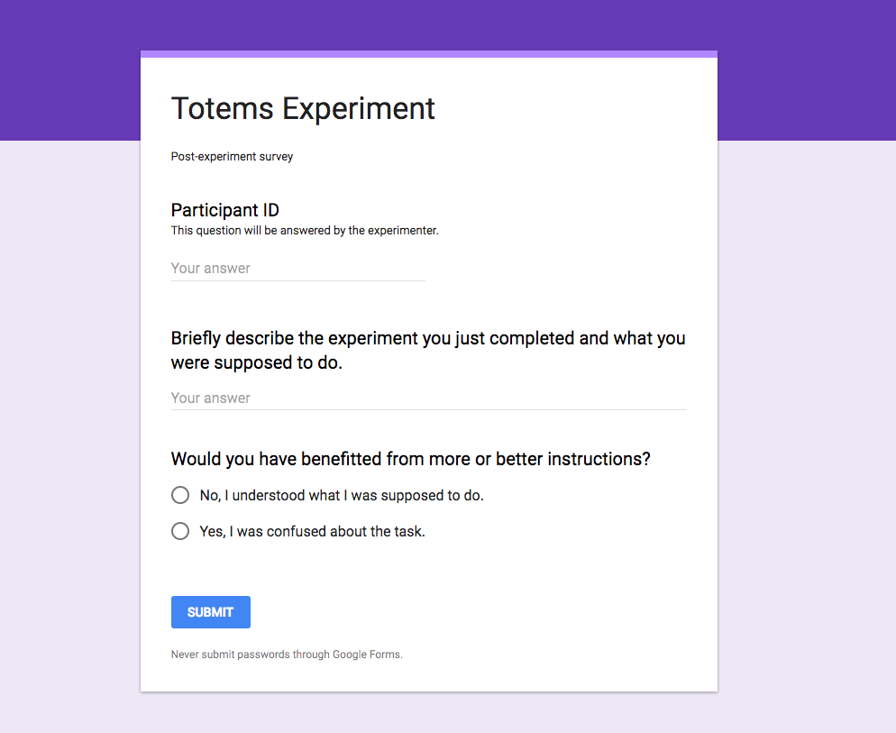

# Post experiment survey

After completing the Totems experiment, participants will be directed to take an online survey about their experience in the game. The primary purpose of this survey is to provide an opportunity for participants to relate any confusion they had about the task and their instructions in order to better understand their performance. Some examples of questions participants will be asked are shown below.

Additional questions that may be asked to assess other aspects of participant performance include:

- How familiar are you with this type of game? (_1-7 Likert scale_)
- How enjoyable did you find the game? (_1-7 Likert scale_)
- How difficult did you find the game? (_1-7 Likert scale_)

Participants will also be asked about a particular strategy they may have employed, and whether or not they were able to determine the primary hypotheses of the experiment. These questions are worded as follows:

- Did you use a specific strategy for combining resources in the game? If so, please describe it. (_short answer_)
- Please describe what you think the experimenters hoped to find as a result of this experiment. (_short answer_)

Additional questions may be asked depending on condition. These questions include:

- How much did having a teammate help you complete this game? (_1-7 Likert scale_)
- How much did it help to start with some innovations left by your ancestor? (_1-7 Likert scale_)
- Compare how hard you tried in this task to how hard you believe your teammate tried. (_multiple choice_)
- How do you think your performance would have changed if you would have had a teammate? (_multiple choice_)

Question wording and response scales may be slightly changed based on feedback from participants, e.g., if they found any of the questions confusing or difficult to answer. Not all of these questions may be asked of every participant depending on condition and length of time.
